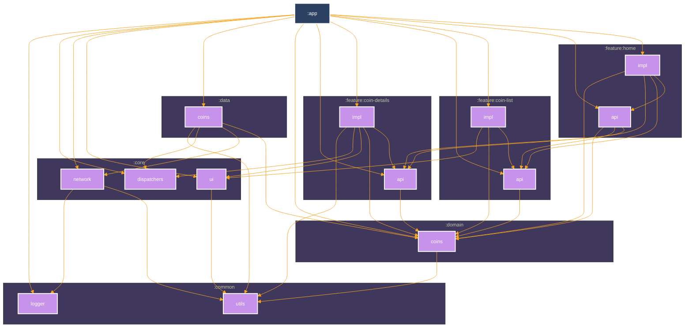

# CryptoCoins

## About
Compose Multiplatform app which shows CryptoMarket coin prices.
* User real  [CoinGecko](https://docs.coingecko.com/reference/introduction) api. 
* Clean and Simple Material UI. 
* Use multi-module Gradle architecture. 

## Built With 🛠
[Kotlin](https://kotlinlang.org/) - First class and official programming language for Android development. 
[Kotlin Gradle DSL](https://docs.gradle.org/current/userguide/kotlin_dsl.html) - Provides an alternative syntax to the traditional Groovy DSL for Gradle build system.  
[Coroutines](https://kotlinlang.org/docs/reference/coroutines-overview.html) - Kotlin Asynchronous or non-blocking programming. 
[Compose](https://developer.android.com/develop/ui/compose/documentation) - The modern toolkit for building native Android UI. 
[Decompose](https://arkivanov.github.io/Decompose/) - Kotlin Multiplatform library for breaking down your code into lifecycle-aware business logic components. 
[Kodein](https://kosi-libs.org/kodein/7.22/index.html) - Useful dependency injection / retrieval container for Kotlin. 
[Ktor](https://ktor.io) - A type-safe Kotlin Multiplatform HTTP client. 
[Kotlin Serialization](https://kotlinlang.org/docs/serialization.html)) - A modern JSON library for Kotlin and Java. 

## Module Graph

## Architecture
This repository uses recommended Android [App architecture](https://developer.android.com/topic/architecture).
